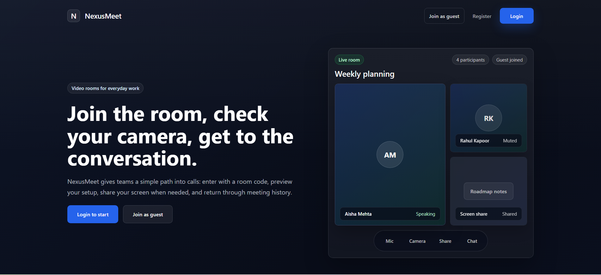
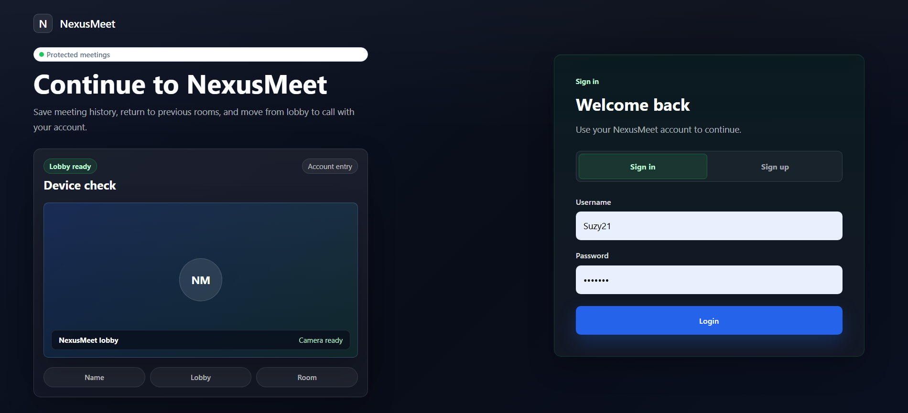

# NexusMeet

NexusMeet is a full-stack video meeting platform built with React, Node.js, Socket.IO, MongoDB, and native WebRTC. It is designed around fast room entry, a device-ready lobby, real-time peer-to-peer calls, meeting chat, screen sharing, and account-based meeting history.

The product experience has been refined into a calm, premium collaboration interface with a dark meeting-room system, clear status feedback, polished dashboards, and responsive layouts across desktop and mobile.

## Preview

### Landing page



### Authentication



## Highlights

- Instant room entry with shareable meeting URLs and room codes.
- Device-ready lobby with local camera preview before joining.
- Peer-to-peer video and audio using the browser WebRTC API.
- Reliable real-time signaling and chat through Socket.IO.
- Screen sharing with restore-to-camera behavior after presenting.
- Account login and registration with secure password hashing.
- Meeting history for returning to previous rooms.
- Polished responsive UI across landing, auth, dashboard, history, and meeting pages.

## Product Experience

NexusMeet focuses on keeping the meeting interface quiet and useful:

- The meeting room centers participants first, with metadata kept compact.
- Waiting states help solo users share the room code without clutter.
- Participant tiles show clear identity and media status.
- The control dock keeps mic, camera, share, chat, participants, and leave actions close at hand.
- Dashboard and history pages support quick return flows for everyday use.

## Tech Stack

### Frontend

- React 18
- React Router
- CSS Modules
- Material UI icons
- Socket.IO Client
- Native WebRTC APIs

### Backend

- Node.js
- Express
- Socket.IO
- MongoDB with Mongoose
- bcrypt for password hashing
- dotenv for environment configuration

## Project Structure

```text
.
├── backend/
│   ├── src/
│   │   ├── app.js
│   │   ├── controllers/
│   │   ├── models/
│   │   └── routes/
│   └── package.json
├── frontend/
│   ├── screenshots/
│   ├── src/
│   │   ├── pages/
│   │   ├── styles/
│   │   └── environment.js
│   └── package.json
└── README.md
```

## Getting Started

### Prerequisites

- Node.js 18 or newer
- npm
- MongoDB, either local or hosted with MongoDB Atlas

### Backend Setup

```bash
cd backend
npm install
```

Create `backend/.env`:

```env
MONGO_URI=mongodb+srv://<username>:<password>@<cluster>/<database>?retryWrites=true&w=majority
PORT=8000
```

Start the backend:

```bash
npm run dev
```

The backend runs on `http://localhost:8000` by default.

### Frontend Setup

```bash
cd frontend
npm install
```

For local development, confirm `frontend/src/environment.js` points to:

```js
http://localhost:8000
```

Start the frontend:

```bash
npm start
```

The frontend runs on `http://localhost:3000`.

## Available Scripts

### Frontend

```bash
npm start
npm run build
npm test
```

### Backend

```bash
npm run dev
npm start
```

## API Overview

User routes are available under `/api/v1/users`.

| Method | Endpoint | Purpose |
| --- | --- | --- |
| `POST` | `/login` | Authenticate a user and return a token |
| `POST` | `/register` | Create a new user account |
| `POST` | `/add_to_activity` | Save a meeting to user history |
| `GET` | `/get_all_activity?token=...` | Fetch meeting history |

## Socket Events

| Event | Purpose |
| --- | --- |
| `join-call` | Join a room and announce the participant |
| `user-joined` | Notify room clients about participant membership |
| `user-left` | Notify clients when a participant leaves |
| `signal` | Exchange WebRTC SDP and ICE messages |
| `chat-message` | Send and receive in-room chat messages |

## Build Verification

The frontend production build can be verified with:

```bash
cd frontend
npm run build
```

## License

This project is released under the ISC License.
